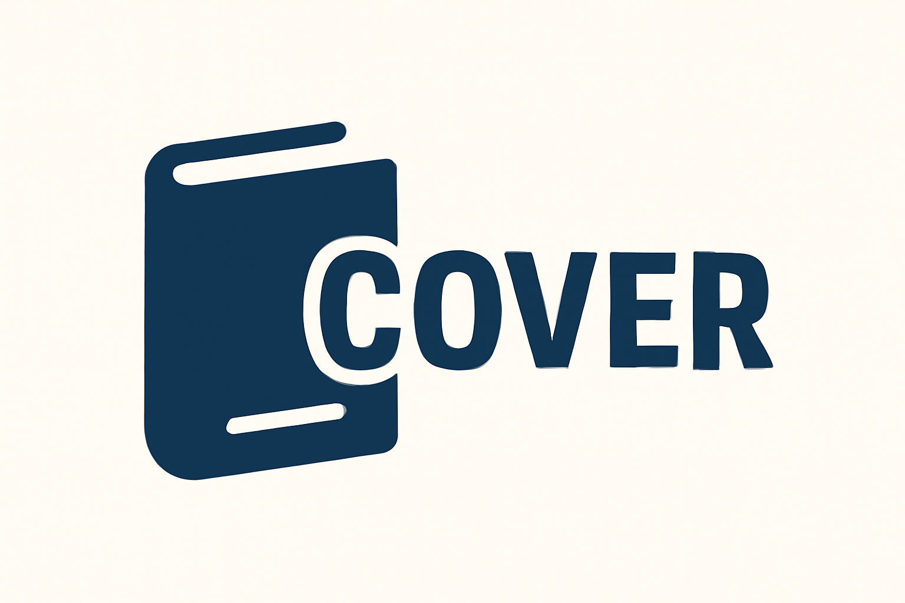

# README.md
# Codenest — Private Local Vault
**Zero-server, password-encrypted, multi-language code workspace.** Everything lives in your browser storage. Optional user-selected backup folder lets you sync via Drive/OneDrive/iCloud (through your OS), without sending data to any server.

## Features
- Local, AES-GCM encrypted vault keyed by your password (PBKDF2-SHA256).
- Multi-page SPA: **Consent → Auth (Register/Login) → App**.
- Editors for HTML, CSS, JS, SVG, SCSS, Markdown, JSON, YAML, SQL, Python, Ruby, PHP, TypeScript, Java, C/C++, Rust (CodeMirror).
- Live preview with console piping; one-click **Run**, **Export ZIP**, **Share standalone HTML**.
- Projects manager: save, load, duplicate, delete, import/export JSON.
- Vault export/import (single encrypted JSON).
- **Backup Folder** (File System Access API): connect a local folder (can be your cloud-synced folder) and enable **Auto-backup** on every save.
- Themes: Dark (default), Light. Layout presets and custom resizable split.
- Account disable toggle (local lock-out).

## Quick Start
1. Download `index.html` and open it in a modern browser.  
2. Approve storage, **Register**, then **Login**.  
3. Edit in the left panels, **Run** to preview.  
4. Open **Account** → **Export Encrypted Vault** for a portable backup.  
5. Optional: **Connect Backup Folder** to mirror your encrypted vault into any folder you choose (Drive/OneDrive/iCloud via OS sync).  

> No servers. Your data never leaves your machine unless you explicitly export or connect a folder.

## Backups & Sync (No Server)
- **Export Encrypted Vault** creates `<username>.codenest.vault.json` (and a manifest when using Backup Folder).
- **Backup Folder** writes encrypted vault + manifest directly to a folder you select. If that folder is watched by Google Drive/OneDrive/iCloud, it syncs like any file on your computer—without Codenest ever seeing it.

## Build/Run
No build required. Single-file app + CDN libraries.

## Security Model
- AES-GCM-256 encryption; key derived with PBKDF2 (SHA-256, 120k iters).
- Encrypted vault stored in `localStorage` by default; session/ephemeral modes supported.
- Passwords are never stored; cannot be recovered.
- Backup files remain encrypted; restore by Import + the same username/password.

## Dependencies (CDNs)
Font Awesome, CodeMirror (core + modes), highlight.js (theme), JSZip, FileSaver, Split.js, LZ-String, Sass.js. See `NOTICES.md`.

## License
See `LICENSE.md` (proprietary, no redistribution). Third-party libs retain their original licenses.

## Screenshots

## Links
- Home: `https://codenest.io`  
- Docs: `./docs/README.md`  
- Security: `./SECURITY.md`  
- Privacy: `./PRIVACY.md`
